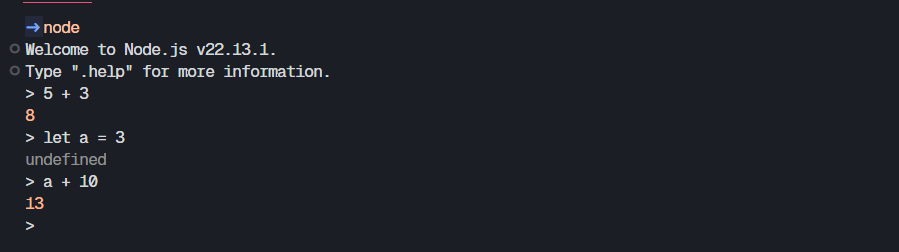

# **Node.js**

## **What is Node.js?**
**Node** is an asynchronous event-driven JavaScript runtime, Node.js is designed to build scalable network applications.

**Node helps to run JavaScript in any place other than the browser.**

## **Advantages**
- **Node helps us to build an application using JavaScript.**

- **By making use of Node.js allows us to use JavaScript across the entire stack from frontend to backend**

- **It is very scalable and huge ecosystem**

## **Node REPL (Read Eval Print Loop)**
It is a computer environment where user inputs are read evaluated, and then the results are returned to the user.

**To initiate Node REPL type `node` command in the terminal after you have installed node in your computer.**

Below is an usecase of Node REPL:

