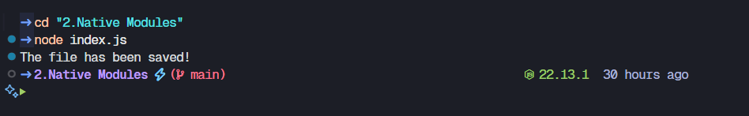

# File system `fs`

**A native node module that allows interacting with the file system in a way modeled on standard POSIX functions.**

**All file system operations have synchronous, callback and promise-based forms and are accessible using both CommonJS syntax and ES6 modules (ESM).**

**To use `fs` import it by using**
- `const fs = require("fs");` 

## `fs.writeFile(file,data[,options],callback)` 

**`fs.writeFile` is a method in Node.js's fs (file system) module that allows you to write data to a file asynchronously. If the file exists, fs.writeFile replaces the file's content. If the file doesn't exist, fs.writeFile creates it.** 

### Using `fs.writeFile`
**Check this Node.js program to see it working: [index.js](index.js)**

## `fs.readFile(path,[,options],callback)`

**fs.readFile is a method that is used to asynchronously read the entire contents of a file.**

### Using `fs.readFile`

